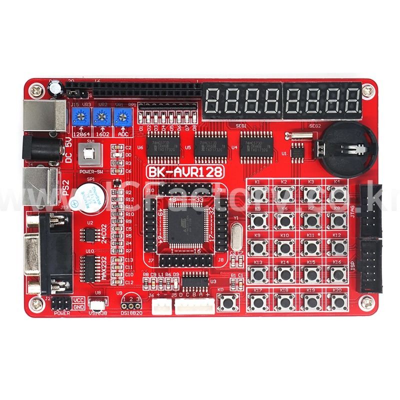

# BK-AVR128 Development Board - Hardware Mapping

[Download or Show Schematic Here <<<<<>>>>>](resources/BK-AVR128%20Schematic.pdf)
## General Info
- **MCU**: ATmega128
- **Clock**: 8MHz External Crystal

## I2C Devices
- **AT24C02 EEPROM**:  
  - SCL - PD0  
  - SDA - PD1

## Communication
- **RS232 DB9**:  
  - RX1-IN - PE0  
  - TX1-IN - PE1  
- **PS/2 Keyboard**:  
  - DAT - PD2  
  - CLK - PD3

## Sensors
- **TL1838 IR Receiver**:  
  - DAT - PE5  
- **DS18B20 Temperature Sensor**:  
  - DAT - PE6

## 74HC573 Controlled LEDs and Displays
- **LEDs** (8 Red LEDs, Active Low):  
  - LED1 - PA0  
  - LED2 - PA1  
  - LED3 - PA2  
  - LED4 - PA3  
  - LED5 - PA4  
  - LED6 - PA5  
  - LED7 - PA6  
  - LED8 - PA7  
- **7 Segment Displays (2 x 4 Digits)**:  
  - Digits 1-4: PA0-PA3  
  - Digits 5-8: PA4-PA7  
  - Segments A-G: PC0-PC7 (Active Low)

## Power and Connectors
- **USB Type B**:  
  - Power Only
- **Power Switch (SW1)**:  
  - To control power supply
- **JTAG/ISP Connectors**:  
  - J11: JTAG  
  - J12: ISP (In-System Programming)

## Documentation
- [ATmega128 Datasheet](https://ww1.microchip.com/downloads/en/DeviceDoc/doc2467.pdf)
